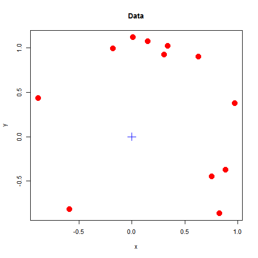
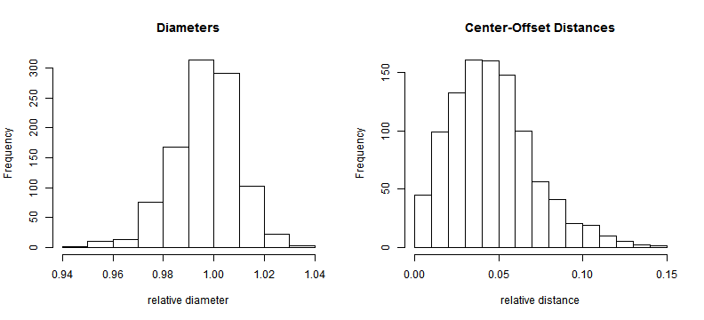

## Disk Measurements

Motivation
* Determine diameter, cross-sectional area, and coordinates of center location from small number of points on disk perimeter
* Prediction performance for a given number of noisy measurement points?
* Effect of the number of measurement points?
* Effect of the noise level in the measurements?

--- .class #id

## Example

Given: 12 measurement points, 5% noise 

--- .class #id

## ShinyApp Functionality

Input parameters:
* Number of measurement points
* Noise (standard deviation of normal noise, relative to true disk diameter)

Output results:     
* Estimates of expected values, standard deviation, bias, rmse
* Histograms of simulated results

--- .class #id
## Equations for Estimation

Coordinates of center location:
$$\left(\hat{x}_c,\hat{y}_c\right) = \left(\frac{1}{n}\sum_{i=1}^{n}{x_i},\frac{1}{n}\sum_{i=1}^{n}{y_i}\right)$$
Disk Diameter:
$$\hat{d} = \frac{2}{n}\sum_{i=1}^{n}{\sqrt{\left(x_i-\hat{x}_c\right)^2
+\left(y_i-\hat{y}_c \right)^2} }$$
Center offset (true center $\left(x_c,y_c\right)$):
$$\hat{r}_c = \sqrt{\left(\hat{x}_c-x_c\right)^2
+\left(\hat{y}_c-y_c\right)^2} $$

--- . class #id

##  Simulations (for 12 measurement points, 5% noise)

Statistics based 1000 bootstrap simulations; results as {expectation, stdev, bias, rmse}

* Rel. Diameter $D/D_{true}:$ {0.944, 0.066, -0.056, 0.087}
* Rel. Offset $r/D_{true}:$ {0.13, 0.067, 0.13, 0.146}

